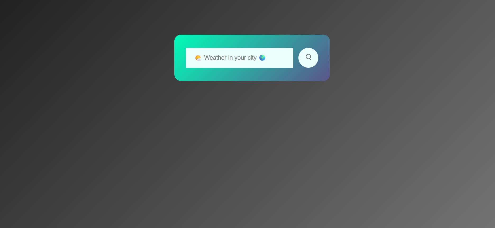
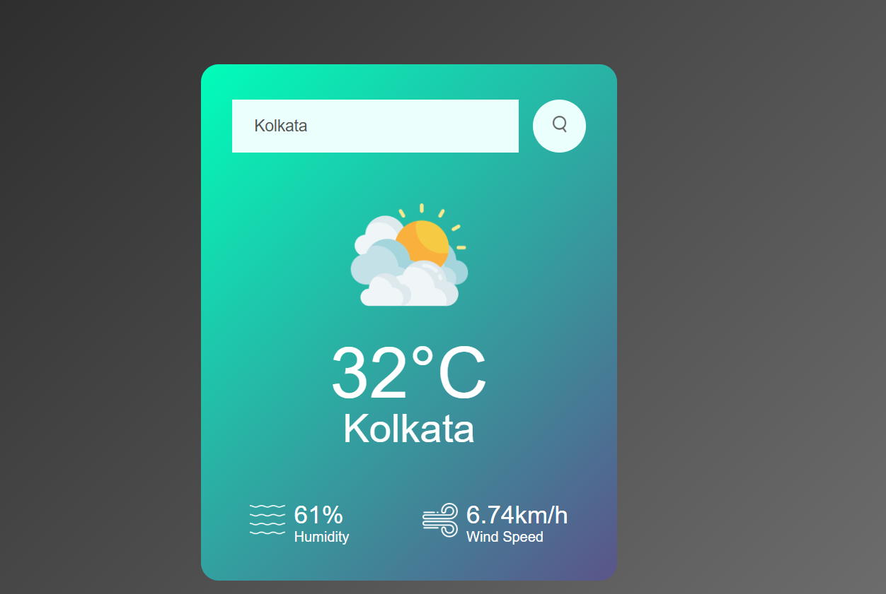

# 🌦️ Weather Report App

A clean and responsive weather application built using HTML, CSS, and JavaScript. It fetches real-time weather data using the OpenWeatherMap API.

---

## 🚀 Live Demo

👉 [View App on Netlify](https://weather-report-saumiklaha.netlify.app/)

> This version is frontend-only and hosted on Netlify.

---

## ✨ Features

- 🌍 Search weather by city name  
- 🌡️ Displays temperature, humidity, wind speed  
- ⚠️ Shows error message for invalid city  
- 📱 Responsive design for all devices

---

## 🛠️ Tech Stack

| Category       | Technologies |
|----------------|--------------|
| **Frontend**   | HTML, CSS, JavaScript |
| **Backend (Local)** | Node.js, Express |
| **API**        | [OpenWeatherMap](https://openweathermap.org/api) |
| **Deployment** | Netlify |
| **Tools**      | Git, npm, dotenv |

---

## 📸 Screenshots

### 🏠 Home Page  


---

### 🌤️ Weather Result – Mumbai  


---

### 🌤️ Weather Result – Kolkata  


---

### ⚠️ Invalid City Error  


---

## 🧪 Run Locally

### 1️⃣ Clone the repository
```bash
git clone https://github.com/SaumikLaha/Weather_Prediction.git
cd Weather_Prediction
---
2️⃣ Install dependencies
npm install
---
3️⃣ Create .env file
WEATHER_API_KEY=your_api_key_here
---
4️⃣ Start the server
node server.js
Open in browser: http://localhost:3000

---

#👨‍💻 Author
Made with ❤️ by Saumik Laha
---
